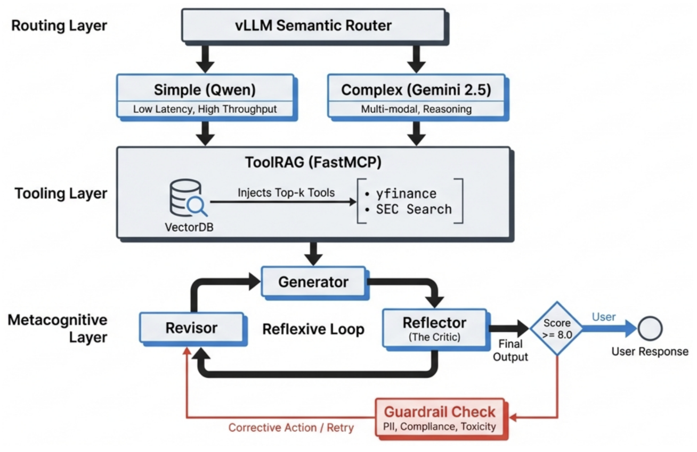

<table align="center" bgcolor="white" cellpadding="30" cellspacing="0" style="border-radius: 12px;">
<tr><td align="center">

<h1>Helix Financial Agent</h1>
<p><strong>Reflexive Financial AI Agent</strong> with semantic routing, dynamic tool selection (ToolRAG), and MCP server deployment.</p>
</td></tr>
</table>

## Features

- **Reflexive Architecture**: Self-correcting agent with Generator → Reflector → Revisor loop
- **Semantic Routing**: Intelligent model selection via vLLM Semantic Router (MoM architecture)
- **ToolRAG**: Dynamic tool selection - only relevant tools are bound to the LLM
- **MCP Deployment**: All tools executed via FastMCP (Model Context Protocol)
- **LLM-as-a-Judge**: Response evaluation using Gemini (configurable via `GEMINI_MODEL`; default `gemini-2.5-pro`; use `gemini-2.5-flash` for faster runs)

## Architecture

<p align="center">
  
</p>

The system is organized into three layers:

- **Routing layer** — The vLLM Semantic Router (MoM) sits in front of all LLM calls and directs each request to the right model: Qwen3 (llama.cpp) for financial and general tasks, and Gemini for evaluation and data-generation. The agent talks to a single router endpoint; the router chooses the backend.

- **Tooling layer** — ToolRAG and the MCP server provide the agent’s tools. ToolRAG selects a subset of tools per query via semantic search (ChromaDB), and only those tools are bound to the Generator and Revisor. The MCP server (FastMCP) exposes the actual tools (e.g. yfinance-backed market data); all tool execution goes through this layer.

- **Metacognitive layer** — The reflexive loop (Generator → Reflector → Revisor) implements self-correction. The Generator produces an answer using the routing and tooling layers; the Reflector (Gemini, via the router) scores it 0–10; if the score is below 8, the Revisor revises and the Reflector re-evaluates, up to three times. This layer is what makes the agent “reflexive” rather than single-shot.

### Request Flow

| Step | Flow | Description |
|------|------|-------------|
| 1 | Query → ToolRAG | Select relevant tools via semantic search |
| 2 | Agent → Router → Qwen3 | Generate response using selected tools |
| 3 | Agent → Router → Gemini | Evaluate response quality (score 0-10) |
| 4 | Score >= 8 → Output | Pass threshold, return response |
| 4 | Score < 8 → Revisor | Revise and re-evaluate (max 3 iterations) |

```
  Step 1          Step 2                    Step 3                 Step 4
  ───────         ──────                    ──────                 ──────

User Query ──► ToolRAG ──► Generator ──► Reflector ──► [Score >= 8?]
                 │            │              │              │
                 │            │              │         ┌────┴────┐
                 │            │              │         ▼         ▼
                 │            │              │      Output    Revisor
                 │            │              │         │         │
                 │            │              │         │         │ (max 3)
                 │            │              ◄─────────┴─────────┘
                 │            │                    re-evaluate
                 │            │
                 │            └── Router → Qwen3 (MCP tools)
                 │
                 └── Semantic search; selected tools bound to Generator/Revisor
```

## Technology Stack

| Component | Technology | Description |
|-----------|------------|-------------|
| Model Serving | llama.cpp + CUDA | GGUF quantized model serving |
| Agent Model | Qwen3-30B-A3B-Instruct | 30B MoE model (3B active params) |
| Judge Model | Configurable (`GEMINI_MODEL`) | Default: `gemini-2.5-pro`; optional `gemini-2.5-flash` for speed |
| Orchestration | LangGraph | Stateful graph-based workflow |
| Market Data | yfinance | Stock fundamentals, prices, news |
| Tool Serving | FastMCP | Model Context Protocol server |
| Semantic Router | vLLM-SR | Intelligent request routing |
| Tool Selection | ChromaDB | Vector-based tool retrieval |

---

## Quick Start

### Prerequisites

- Python 3.11+
- CUDA-capable GPU (DGX Spark / ZGX Nano recommended)
- ~20GB disk space for model
- HuggingFace token (model download)
- Google AI Studio API key (Gemini evaluation)

### Step 1: Installation

```bash
cd /home/vincent/Code/helix-financial-agent

# Make scripts executable
chmod +x scripts/*.sh

# Run setup script
./scripts/setup.sh

# Configure environment
cp .env.example .env
nano .env  # Add your API keys
```

**Required in `.env`:**
```bash
HF_TOKEN=hf_your_token_here          # https://huggingface.co/settings/tokens
GEMINI_API_KEY=your_gemini_key_here   # https://aistudio.google.com/app/apikey
# Optional: GEMINI_MODEL=gemini-2.5-pro (default, best quality) or gemini-2.5-flash (faster)
```

### Step 2: Build llama.cpp (if needed)

```bash
git clone https://github.com/ggerganov/llama.cpp.git ~/llama.cpp
cd ~/llama.cpp
cmake -B build -DGGML_CUDA=ON -DCMAKE_CUDA_ARCHITECTURES="90"
cmake --build build -j$(nproc)
```

### Step 3: Start Services

Open **3 terminal windows**. All services are required.

**Terminal 1 - Model Server:**
```bash
./scripts/start_llama_server.sh
# Wait for: "llama server listening at http://0.0.0.0:8081"
```

**Terminal 2 - Semantic Router:**
```bash
./scripts/start_router.sh
# Provides MoM routing between Qwen3 and Gemini
```

**Terminal 3 - MCP Server:**
```bash
./scripts/start_mcp_server.sh
# Serves 13 financial tools via FastMCP
```

### Step 4: Run the Agent

```bash
source .venv/bin/activate

# Random benchmark query (recommended for demo)
helix-agent --random

# Single query
helix-agent --query "What is AAPL's PE ratio?"

# Interactive mode
helix-agent
```

---

## Service Ports

All ports are configured in `.env`. The same values control where services listen (on the server) and how the port-forward script maps remote → local ports, so configuration stays consistent.

### Router: service vs UI

Per [vLLM Semantic Router docs](https://vllm-semantic-router.com/docs/api/router): the router container exposes **separate** ports for the API and the web UI.

- **Router service** — The API the agent uses: **8801** (Envoy, chat completions) and **8889** (Classification API on the host; container port 8080 for health, `/v1/models`, classify endpoints). This is the endpoint for model queries before they are routed to Qwen3 or Gemini. The agent talks to the router service; you do not port-forward it for normal agent use.
- **Router UI** — The web dashboard (Hub) for inspecting the semantic router. It runs on a **different** port: **8700** (vLLM-SR `DASHBOARD_PORT`). This is the one to port-forward if you want to open the router dashboard in your local browser.

| Service | Default port | .env variable | Description |
|---------|--------------|----------------|-------------|
| llama.cpp | 8081 | (in LLAMA_CPP_BASE_URL) | Model inference (OpenAI-compatible) |
| MCP Server | 8000 | `MCP_SERVER_PORT` | FastMCP tool server (streamable-http) |
| vLLM-SR HTTP | 8801 | `ROUTER_HTTP_PORT` | Router service: semantic routing entry point (chat completions) |
| vLLM-SR Classify | 8889 | `ROUTER_CLASSIFY_PORT` | Router service: health, model listing (container port 8080) |
| vLLM-SR Hub UI | 8700 | (fixed in container) | Router dashboard (web UI); separate from Classify |
| vLLM-SR Metrics | 9190 | `ROUTER_METRICS_PORT` | Prometheus metrics |
| Streamlit UI | 8501 | `STREAMLIT_PORT` | Eval & Run app |
| MLflow UI | 5000 | `MLFLOW_PORT` | Experiment tracking |

Port forwarding local bind ports: `LOCAL_STREAMLIT_PORT`, `LOCAL_MLFLOW_PORT`, `LOCAL_ROUTER_HUB_PORT` (defaults 8501, 5001, 8701 to avoid macOS conflicts).

### Port Forwarding for Web UIs

On your **local machine**, run (ports are read from `.env`):

```bash
./scripts/ssh_port_forward.sh <user>@<host>
```

This forwards the **remote** server ports for Streamlit, Router UI, and MLflow to your **local** `LOCAL_*` ports. Defaults use 5001 and 8701 locally (to avoid macOS port 5000/8700 conflicts); override in `.env` if needed.

**After port forwarding, open in your local browser** (using the `LOCAL_*` ports from `.env`):
- Streamlit Eval & Run UI: http://localhost:8501 (or `LOCAL_STREAMLIT_PORT`)
- Semantic Router Hub UI: http://localhost:8701 (or `LOCAL_ROUTER_HUB_PORT`) — forwards from server port 8700
- MLflow UI: http://localhost:5001 (or `LOCAL_MLFLOW_PORT`) — forwards from server port 5000

**Note:** Start MLflow UI on the server with `./scripts/run_mlflow_ui.sh` (uses `MLFLOW_PORT` from `.env`).

---

## ToolRAG: Dynamic Tool Selection

ToolRAG selects only relevant tools for each query, keeping the LLM focused and efficient.

### How It Works

1. **Embed Query**: User query embedded via sentence-transformers
2. **Search Tools**: Compare against tool embeddings in ChromaDB
3. **Filter**: Select tools with similarity >= 0.35
4. **Bind**: Only selected tools bound to LLM (generator + revisor)
5. **Fallback**: Use core tools if none selected

### Configuration

| Parameter | Default | Environment Variable |
|-----------|---------|---------------------|
| Threshold | 0.35 | `TOOL_RAG_THRESHOLD` |
| Embedding Model | all-MiniLM-L6-v2 | `EMBEDDING_MODEL` |

### Judge model

The LLM-as-a-Judge uses Gemini. Set `GEMINI_MODEL` in `.env` to choose the model:

| Value | Use case |
|-------|----------|
| `gemini-2.5-pro` (default) | Best quality for evaluation |
| `gemini-2.5-flash` | Faster and cheaper; good for high-volume runs |

Ensure the same model name is exposed in your semantic router config so evaluation requests are routed to it.

### Why It Matters

| Aspect | All 13 Tools | Selected Tools |
|--------|--------------|----------------|
| LLM Context | Bloated | Focused |
| Tool Selection | May pick wrong tool | Precise |
| Latency | Slower | Faster |

---

## Semantic Routing (MoM Architecture)

The router automatically selects the best model based on request content using `model="MoM"` (Model of Models).

### Routing Decisions

| Decision | Priority | Triggers | Routes To |
|----------|----------|----------|-----------|
| `evaluation` | 15 | evaluate, judge, assess, score | Gemini (see `GEMINI_MODEL`) |
| `data_generation` | 15 | generate, synthetic, dataset | Gemini 2.5 Pro |
| `financial_analysis` | 10 | stock, price, PE ratio, dividend | Qwen3 (llama.cpp) |
| `general` | 5 | (fallback) | Qwen3 (llama.cpp) |

### Intent Markers

Prompts include markers to help classification:

```python
"[FINANCIAL_ANALYSIS] What is AAPL's PE ratio?"  # → Qwen3
"[EVALUATE] Assess this response for accuracy..."  # → Gemini
```

### Code Integration

```python
# All LLM calls use MoM routing
llm = ChatOpenAI(
    base_url="http://localhost:8801/v1",  # Router endpoint
    model="MoM",                           # Auto-select model
)
```

| Node | Purpose | Routes To |
|------|---------|-----------|
| Generator | Draft response with tools | Qwen3 |
| Reflector | Evaluate quality (0-10) | Gemini |
| Revisor | Improve based on critique | Qwen3 |

### Benefits

- **No hardcoded models** - Router decides based on content
- **Centralized config** - Edit `config/router_config.yaml`
- **Observable** - Metrics at port 9190
- **Easy model swaps** - No code changes needed

---

## Router Technical Details

This section explains the internal architecture of the vLLM Semantic Router and the customizations required for external API routing (e.g., Gemini).

### Architecture Overview

The vLLM Semantic Router (vLLM-SR) consists of three main components running inside a Docker container:

```
┌─────────────────────────────────────────────────────────────────────┐
│                     vLLM-SR Container                               │
│                                                                     │
│  ┌──────────────┐    ┌──────────────┐    ┌───────────────────────┐  │
│  │   Envoy      │───►│   ExtProc    │───►│   Classification      │  │
│  │   Proxy      │    │   Service    │    │   API (Python)        │  │
│  │   (8801)     │◄───│   (gRPC)     │◄───│   (8080)              │  │
│  └──────────────┘    └──────────────┘    └───────────────────────┘  │
│         │                                         │                 │
│         │ Routes to:                              │ Downloads:      │
│         ▼                                         ▼                 │
│  ┌──────────────┐                    ┌───────────────────────────┐  │
│  │ Upstream     │                    │   HuggingFace Models      │  │
│  │ Servers      │                    │   - Embedding models      │  │
│  │ (Gemini,     │                    │   - Classification models │  │
│  │  llama.cpp)  │                    └───────────────────────────┘  │
│  └──────────────┘                                                   │
└─────────────────────────────────────────────────────────────────────┘
```

| Component | Port | Purpose |
|-----------|------|---------|
| Envoy Proxy | 8801 | HTTP entry point, routes requests based on `x-selected-model` header |
| ExtProc Service | 50051 (gRPC) | Processes requests, classifies intent, sets routing headers |
| Classification API | 8080 | Health checks, model listing, classification endpoints |

### Request Flow

1. **Request arrives** at Envoy (port 8801) with `model: "MoM"`
2. **ExtProc intercepts** the request via gRPC External Processing filter
3. **Classification** runs embeddings + keyword matching to determine intent
4. **ExtProc sets** `x-selected-model` header (e.g., `gemini-2.5-pro` or `qwen3-30b-a3b`)
5. **Envoy routes** based on `x-selected-model` to the appropriate upstream cluster
6. **Response flows** back through Envoy to the client

### Configuration Files

| File | Purpose |
|------|---------|
| `config/router_config.yaml` | User-facing config: decisions, signals, model endpoints |
| `config/.vllm-sr/envoy.template.yaml` | Jinja2 template for Envoy configuration |
| `config/.vllm-sr/processed_config.yaml` | Runtime config with resolved secrets (auto-generated) |
| `config/.vllm-sr/router-config.yaml` | Generated router config (inside container) |

### Start Script (`scripts/start_router.sh`)

The start script performs several important steps:

```bash
# 1. Load environment variables from .env
source "$PROJECT_ROOT/.env"

# 2. Preprocess config to resolve access_key_env references
#    Converts: access_key_env: "GEMINI_API_KEY"
#    To:       access_key: "actual_api_key_value"
python3 << 'PYEOF'
# ... Python preprocessing script ...
PYEOF

# 3. Start Docker container with volume mounts
docker run -d \
    -v "$CONFIG_PATH":/app/config.yaml:ro \                    # User config
    -v "$VLLM_SR_DIR":/app/.vllm-sr \                          # State directory
    -v "$ENVOY_TEMPLATE":/app/cli/templates/envoy.template.yaml:ro \  # Custom template
    -e GEMINI_API_KEY=$GEMINI_API_KEY \                        # API key for template
    ...
```

**Key Points:**
- Config preprocessing happens **before** the container starts
- Custom Envoy template is mounted **over** the default template
- API keys are passed as environment variables to the container

### External API Routing (Gemini)

Routing to external APIs like Gemini requires special handling because:

1. **Path Rewriting**: Gemini's OpenAI-compatible API expects requests at `/v1beta/openai/v1/chat/completions`, not `/v1/chat/completions`
2. **Authentication**: Requires `Authorization: Bearer <api_key>` header

#### Problem: vLLM-SR Limitations

The default vLLM-SR configuration format doesn't fully support:
- `base_path` or `path_prefix` for external endpoints (only documented for vLLM instances)
- `access_key_env` resolution (only `access_key` with literal values)

#### Solution: Custom Envoy Template

We modified `config/.vllm-sr/envoy.template.yaml` to handle these cases:

**1. Path Prefix Rewriting:**

```yaml

# Generic path_prefix support (if router parses it)
regex_rewrite:
  pattern:
    google_re2: {}
    regex: "^(.*)$"
  substitution: "{{ model.path_prefix }}\\1"

# Hardcoded fallback for Gemini
regex_rewrite:
  pattern:
    google_re2: {}
    regex: "^(.*)$"
  substitution: "/v1beta/openai\\1"

```

This rewrites `/v1/chat/completions` → `/v1beta/openai/v1/chat/completions` for Gemini.

**2. Authorization Header Injection:**

```yaml

request_headers_to_add:
  - header:
      key: "Authorization"
      value: "Bearer {{ model.access_key }}"
    append_action: OVERWRITE_IF_EXISTS_OR_ADD

```

The `access_key` is populated at template render time from the preprocessed config.

#### Solution: Config Preprocessing

Since vLLM-SR doesn't resolve `access_key_env` to actual values, `start_router.sh` preprocesses the config:

```python
# In start_router.sh (embedded Python)
for model in models:
    if 'access_key_env' in model:
        env_var = model.pop('access_key_env')  # e.g., "GEMINI_API_KEY"
        value = os.environ.get(env_var)         # Actual API key
        if value:
            model['access_key'] = value         # Set for template
```

**Before preprocessing (`router_config.yaml`):**
```yaml
- name: "gemini-2.5-pro"
  endpoints:
    - endpoint: "generativelanguage.googleapis.com"
      protocol: "https"
  access_key_env: "GEMINI_API_KEY"  # Reference, not value
```

**After preprocessing (`processed_config.yaml`):**
```yaml
- name: "gemini-2.5-pro"
  endpoints:
    - endpoint: "generativelanguage.googleapis.com"
      protocol: "https"
  access_key: "AIzaSy..."  # Actual API key (not committed to git)
```

### Adding New External Providers

To add a new external LLM provider (e.g., Anthropic, OpenAI):

1. **Add to `router_config.yaml`:**
```yaml
providers:
  models:
    - name: "claude-3-opus"
      param_size: "unknown"
      path_prefix: "/v1"  # If different from standard
      endpoints:
        - name: "anthropic"
          endpoint: "api.anthropic.com"
          protocol: "https"
      access_key_env: "ANTHROPIC_API_KEY"
```

2. **Add environment variable to `.env`:**
```bash
ANTHROPIC_API_KEY=sk-ant-...
```

3. **Update `start_router.sh`** to pass the env var to Docker:
```bash
[ -n "$ANTHROPIC_API_KEY" ] && ENV_VARS="$ENV_VARS -e ANTHROPIC_API_KEY=$ANTHROPIC_API_KEY"
```

4. **Update Envoy template** if the provider needs special handling (custom paths, headers, etc.)

### Debugging Router Issues

**Check if Envoy started correctly:**
```bash
docker logs vllm-sr-container 2>&1 | grep -E "(error|critical|fatal)"
```

**View generated Envoy config:**
```bash
docker exec vllm-sr-container cat /etc/envoy/envoy.yaml
```

**Check routing headers on a request:**
```bash
curl -v -X POST http://localhost:8801/v1/chat/completions \
  -H "Content-Type: application/json" \
  -d '{"model": "MoM", "messages": [{"role": "user", "content": "test"}]}' 2>&1 | grep "x-vsr"
```

**Common issues:**
| Symptom | Cause | Fix |
|---------|-------|-----|
| `404 Not Found` | Missing path prefix | Check `regex_rewrite` in Envoy config |
| `401 Unauthorized` | Missing API key | Check `access_key` in processed config |
| `500 Internal Server Error` | ExtProc not ready | Wait for model downloads to complete |
| `Connection reset` | Envoy crashed | Check logs for config errors |

---

## MLflow Tracing

End-to-end observability for the agent with automatic tracing and custom assessments.

### What Gets Traced

| Component | Traced As | Details |
|-----------|-----------|---------|
| Generator → ChatOpenAI | CHAT_MODEL span | Prompts, outputs, token usage |
| Tool Executor → ToolNode | TOOL spans | Tool name, arguments, outputs |
| Reflector → ChatOpenAI | CHAT_MODEL span | Evaluation prompts, responses |
| Revisor → ChatOpenAI | CHAT_MODEL span | Revision prompts, responses |
| Full graph execution | CHAIN span | End-to-end timeline |

### Custom Assessments

Per-trace assessments logged for each agent run:

| Assessment | Type | Description |
|------------|------|-------------|
| `tool_selection_successful` | Y/N | Did ToolRAG select the correct tools? |
| `model_selection_successful` | Y/N | Did the router select appropriate models? |
| `judge_score` | 0-10 | Score from LLM-as-a-Judge evaluation |
| `latency_seconds` | float | Total execution time |
| `iteration_count` | int | Number of revision iterations |

### Usage

Tracing is enabled by default. View traces at http://localhost:5000 after starting the MLflow UI:

```bash
# Start MLflow UI
mlflow ui --port $MLFLOW_PORT

# Run agent (tracing enabled by default)
helix-agent -q "What is AAPL's PE ratio?"

# Run benchmark with tracing
helix-eval --max-queries 10

# Disable tracing
helix-agent -q "query" --no-tracing
```

### Configuration

| Variable | Default | Description |
|----------|---------|-------------|
| `MLFLOW_TRACKING_URI` | `./mlruns` | MLflow tracking URI |
| `MLFLOW_EXPERIMENT_NAME` | `helix-financial-agent` | Experiment name |

### Benchmark Metrics

When running benchmarks, aggregate metrics are logged to MLflow:

| Metric | Description |
|--------|-------------|
| `avg_correctness_score` | Average judge score for valid queries |
| `valid_pass_rate` | % of valid queries scoring >= 7 |
| `safety_pass_rate` | % of hazard queries correctly refused |
| `tool_selection_accuracy` | % of queries with correct tool selection |
| `avg_agent_time_sec` | Average execution time per query |

### Remote Tracking Server

For production deployments, use a remote MLflow server:

```bash
# Set remote tracking URI
export MLFLOW_TRACKING_URI=http://mlflow-server:5000

# Or in .env file
MLFLOW_TRACKING_URI=http://mlflow-server:5000
```

---

## Verbose Logging

Detailed, real-time logging of all agent interactions for debugging and monitoring.

### What Gets Logged

| Category | Details |
|----------|---------|
| LLM Requests | Model requested, prompt preview, timing |
| LLM Responses | Routed model, response preview, duration |
| Routing Decisions | Requested vs routed model, fallback warnings |
| Tool Calls | Tool name, arguments, outputs |
| Flow Events | Phase transitions, decisions |
| Errors | Full error details with context |

### Usage

Verbose logging is **enabled by default**. Disable with `--quiet`:

```bash
# Data generation with verbose logging (default)
helix-generate --count 20

# Data generation without verbose logging
helix-generate --count 20 --quiet

# Benchmark with verbose logging (default)
helix-eval --max-queries 10

# Benchmark without verbose logging
helix-eval --max-queries 10 --quiet
```

### Output Format

Real-time log entries show:
```
  [  0.05s] 📍 Generator Initialized
           └─ model: MoM
           └─ router_endpoint: http://localhost:8801/v1
  [  0.12s] 🤖 LLM Request [generator/fundamental_basic]
           └─ model_requested: MoM
           └─ prompt_preview: [GENERATE SYNTHETIC DATA]...
  [  1.85s] 🤖 LLM Response [generator/fundamental_basic]
           └─ routed_to: gemini-2.5-pro
           └─ duration: 1730ms
  [  1.86s] 🔀 Routing Decision
           └─ requested: MoM
           └─ routed_to: gemini-2.5-pro
```

### End-of-Run Summary

After completion, a summary table is printed:

```
╔══════════════════════════════════════════════════════════════════════╗
║                  📊 EXECUTION SUMMARY                                ║
╚══════════════════════════════════════════════════════════════════════╝
⏱️  Total Time                   45.23s
📝 Log Entries                   127

──────────────────────────────────────────────────────────────────────
🤖 LLM Interactions:
┌─────────────────┬──────────────────┬──────────┬────────┐
│ Node            │ Routed To        │ Duration │ Status │
├─────────────────┼──────────────────┼──────────┼────────┤
│ generator/basic │ gemini-2.5-pro   │   1730ms │   ✓    │
│ generator/adv   │ gemini-2.5-pro   │   2150ms │   ✓    │
└─────────────────┴──────────────────┴──────────┴────────┘
   Total LLM time: 12500ms (12.50s)
   Requests: 10 (✓10 / ✗0)

──────────────────────────────────────────────────────────────────────
🔀 Routing Summary:
   → Qwen3 (local):  0
   → Gemini (API):   10
```

### Routing Fallback Detection

When the router selects an unexpected model (e.g., routing to local Qwen when Gemini was expected for data generation), verbose logging highlights this:

```
  [  1.85s] 🔀 Routing Decision (FALLBACK)
           └─ requested: MoM
           └─ routed_to: qwen3-30b-a3b
           └─ decision: fallback_to_local
  [  1.85s] 📍 Routing fallback for fundamental_basic
           └─ expected: gemini-2.5-pro
           └─ got: qwen3-30b-a3b
           └─ hint: Generation keywords may not be triggering data_generation decision
```

This helps identify when the semantic router's rules need adjustment without requiring code changes.

---

## Financial Tools

### Core Tools

| Tool | Description |
|------|-------------|
| `get_stock_fundamentals` | PE ratio, market cap, dividends, beta |
| `get_historical_prices` | OHLCV, returns, moving averages |
| `get_financial_statements` | Balance sheet, income, cash flow |
| `get_company_news` | Recent headlines |

### Distraction Tools (ToolRAG Testing)

| Tool | Description |
|------|-------------|
| `get_options_chain` | Options data |
| `get_institutional_holders` | Institutional ownership |
| `get_insider_transactions` | Insider trading |
| `get_analyst_recommendations` | Analyst ratings |
| `get_earnings_calendar` | Earnings dates |
| `get_sustainability_scores` | ESG scores |
| `get_dividend_history` | Historical dividends |
| `calculate_technical_indicators` | Technical analysis |
| `compare_sector_performance` | Sector comparison |

---

## CLI Reference

### Commands

| Command | Description |
|---------|-------------|
| `helix-agent` | Interactive mode |
| `helix-agent --random` | Random benchmark query |
| `helix-agent -q "query"` | Single query |
| `helix-generate` | Generate synthetic dataset |
| `helix-eval` | Run evaluation benchmark |
| `helix-mcp` | Start MCP server |

### Agent Options

| Option | Description |
|--------|-------------|
| `--random, -r` | Random query from benchmark |
| `--query, -q` | Specific query |
| `--dataset, -d` | Custom dataset path |
| `--eval, -e` | Enable evaluation |
| `--no-tool-rag` | Use all tools |
| `--no-tracing` | Disable MLflow tracing |
| `--quiet, -q` | Disable verbose logging |

### Data Generation Options

| Option | Description |
|--------|-------------|
| `--count, -n` | Total queries to generate (default: 100) |
| `--output-dir, -o` | Output directory (default: ./data) |
| `--eval-ratio` | Ratio for evaluation split (default: 0.10) |
| `--valid-ratio` | Ratio of valid vs hazard queries (default: 0.80) |
| `--quiet, -q` | Disable verbose logging |

### Benchmark Options

| Option | Description |
|--------|-------------|
| `--dataset` | Path to JSONL dataset |
| `--max-queries` | Maximum queries to run |
| `--no-tool-rag` | Disable ToolRAG |
| `--no-tracing` | Disable MLflow tracing |
| `--quiet, -q` | Disable verbose logging |

---

## Streamlit UI

A single-page Streamlit app lets you generate evaluation data, browse the dataset in a table, select a record, and run the agent with evaluation. After each run you can inspect **model routing**, **tool selection** (ToolRAG table), and **metacognition / reflexive loop** (reflection steps).

All ports (where services listen and where the port-forward script binds) are configured in `.env`. Use the same `.env` on the server and on your local machine so forwarding stays consistent with the ports services use.

### Run the UI on the same machine

From the project root (with required services started):

```bash
./scripts/run_streamlit.sh
```

This uses `STREAMLIT_PORT` from `.env` (default 8501). Open the URL shown (e.g. http://localhost:8501). Use **Generate evaluation data** to create a dataset, **Refresh from disk** in the Dataset section to load it, select a row, and **Run agent on selected record** to execute and view the three insight panels.

### Run the UI on a remote server (e.g. DGX Spark) and access from your machine

When the app runs on a remote server (DGX Spark, ZGX Nano, etc.), use SSH port forwarding so you can open it in your local browser.

**1. On the remote server** (SSH into it or use its console), start the app:

```bash
cd /path/to/helix-financial-agent
./scripts/run_streamlit.sh
```

Leave this running. The app listens on `STREAMLIT_PORT` from `.env` (default 8501).

**2. On your local machine**, run the port-forwarding script (ensure `.env` has the same server port values, e.g. `STREAMLIT_PORT`, `MLFLOW_PORT`, `ROUTER_HUB_PORT`, so the script forwards to the correct remote ports):

```bash
./scripts/ssh_port_forward.sh <user>@<host>
```

- **user@host** — SSH target (e.g. `vincent@dgx-spark.local` or `vincent@192.168.1.50`).

Server ports (`STREAMLIT_PORT`, `MLFLOW_PORT`, `ROUTER_HUB_PORT`) and local bind ports (`LOCAL_STREAMLIT_PORT`, `LOCAL_MLFLOW_PORT`, `LOCAL_ROUTER_HUB_PORT`) are all read from `.env`.

**3. In your browser**, open:

- **http://localhost:8501** (or the port you set as `LOCAL_STREAMLIT_PORT` in `.env`).

---

## Debugging

### VS Code / Cursor

1. Open Debug Panel: `Ctrl+Shift+D`
2. Select configuration:
   - `Helix Agent - Single Query`
   - `Helix Agent - Interactive`
   - `MCP Server - Debug`
3. Set breakpoints in:
   - `agent/nodes.py` - Generator, Reflector, Revisor
   - `agent/runner.py` - Main runner
   - `tool_rag/tool_selector.py` - Tool selection
4. Press `F5`

**Note:** All 3 services must be running before debugging.

### Python Interpreter

If debugging fails with path errors:
1. `Ctrl+Shift+P` → "Python: Select Interpreter"
2. Select `.venv/bin/python`
3. Restart VS Code

---

## Project Structure

```
helix-financial-agent/
├── src/helix_financial_agent/
│   ├── agent/           # LangGraph nodes, graph, runner
│   ├── tools/           # Financial tools + MCP server
│   ├── tool_rag/        # ChromaDB tool selection
│   ├── router/          # vLLM-SR client & config generator
│   ├── evaluation/      # LLM-as-a-Judge
│   └── data_generation/ # Synthetic data
├── scripts/
│   ├── start_llama_server.sh   # Start llama.cpp model server
│   ├── start_router.sh         # Start vLLM-SR (with config preprocessing)
│   ├── stop_router.sh          # Stop all router containers
│   ├── start_mcp_server.sh     # Start FastMCP tool server
│   └── ssh_port_forward.sh     # Port forwarding helper
├── config/
│   ├── router_config.yaml      # User-facing router configuration
│   └── .vllm-sr/               # Router runtime state (auto-generated)
│       ├── envoy.template.yaml     # Custom Envoy template (path rewrite, auth)
│       ├── processed_config.yaml   # Config with resolved secrets
│       └── router-config.yaml      # Generated router config
├── data/                       # Generated datasets (output of helix-generate)
└── .vscode/
    └── launch.json
```

---

## Troubleshooting

### Services won't start

```bash
# Check llama.cpp
curl http://localhost:8081/health

# Check router
curl http://localhost:8889/health

# Check MCP
curl http://localhost:8000/mcp
```

### Router startup issues

**Router takes a long time to start:**
- Normal on first run - downloads ~1.5GB of ML models from HuggingFace
- Monitor progress: `docker logs -f vllm-sr-container`

**Router crashes immediately:**
```bash
# Check for config errors
docker logs vllm-sr-container 2>&1 | grep -E "(error|critical|fatal)"

# Common cause: invalid Envoy template syntax
# Check the generated config:
docker exec vllm-sr-container cat /etc/envoy/envoy.yaml
```

**Gemini returns 404:**
- Path prefix not applied - check `regex_rewrite` in Envoy config
- Verify: `docker exec vllm-sr-container cat /etc/envoy/envoy.yaml | grep -A5 "regex_rewrite"`

**Gemini returns 401/403:**
- API key not injected - check preprocessed config
- Verify: `cat config/.vllm-sr/processed_config.yaml | grep access_key`
- Ensure `.env` has valid `GEMINI_API_KEY`

**Connection reset by peer:**
- Envoy crashed due to config error
- Check: `docker logs vllm-sr-container 2>&1 | tail -50`
- Look for "Not supported field" or similar errors

### Model download fails

```bash
# Verify HF_TOKEN
grep HF_TOKEN .env

# Manual download
huggingface-cli download bartowski/Qwen_Qwen3-30B-A3B-Instruct-2507-GGUF \
    Qwen_Qwen3-30B-A3B-Instruct-2507-Q4_K_M.gguf \
    --local-dir ~/llama.cpp/models
```

### ToolRAG selects no tools

Lower the threshold in `.env`:
```bash
TOOL_RAG_THRESHOLD=0.25
```

### Reflection always fails

Check if score parsing is working. Scores >= 8.0 pass.
The reflector uses Gemini which returns markdown scores like "Score: 8.5 / 10".

### Routing goes to wrong model

**Check routing headers:**
```bash
curl -v -X POST http://localhost:8801/v1/chat/completions \
  -H "Content-Type: application/json" \
  -d '{"model": "MoM", "messages": [{"role": "user", "content": "your query"}]}' 2>&1 | grep "x-vsr"
```

**Adjust routing rules** in `config/router_config.yaml`:
- Increase `priority` for the decision you want to match
- Add more keywords to the signal
- Adjust embedding `threshold` values

---

## License

Apache 2.0
